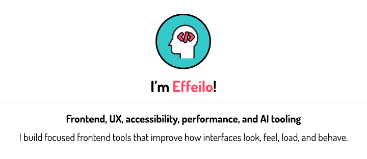
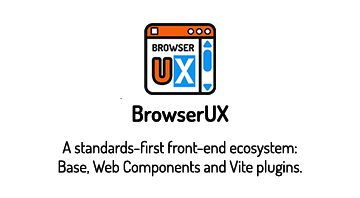
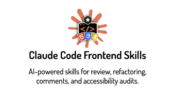

  

  
  

 

  

    
    
    
    
    
    
    
    
    
  

<!--
---
## About

Frontend developer with 15+ years of experience, I build demanding interfaces focused on user experience, accessibility, and performance.

I also integrate AI into my workflows to automate repetitive tasks, accelerate production, and streamline phases of exploration, implementation, and learning.

Combined with strong technical experience, this approach allows me to bring companies both vision and efficiency, with execution that is reliable, fast, and built to last.

    

-->